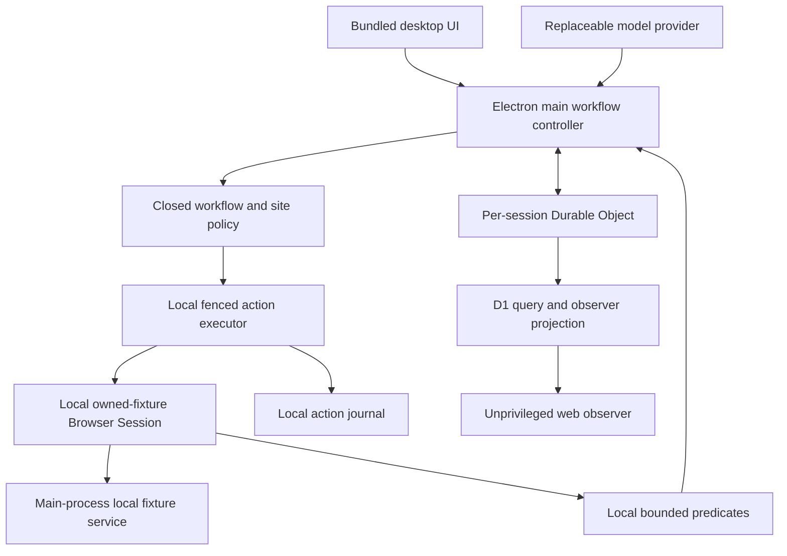

# feat: Prove Village delegated value on an owned fixture

## Goal Capsule

- **Objective:** Ship one fixed, terms-safe demo-account setup Job in which ChatGPT chooses bounded Browser Actions, the owner sees each effect in Village's side pane, takeover and hand-back are safe, a second device sees sanitized progress, and restart or reconnect never repeats a logical effect.
- **Authority:** The confirmed product scope in this plan governs behavior. `CONTEXT.md` governs vocabulary. The existing browser trust boundary, data lifecycle, and recovery documents govern security and continuity.
- **Execution profile:** Deep, cross-process, proof-first work across contracts, the owned fixture, Electron, the Cloudflare control plane, and the observer. Establish durable workflow truth before presenting polished progress UI.
- **Stop conditions:** Stop rather than broaden the browser grammar to arbitrary URLs, selectors, raw CDP, JavaScript, page text, or LinkedIn automation. Stop on any design that makes model-thread memory or renderer state authoritative for recovery.
- **Tail ownership:** `ce-work` owns implementation, focused and full verification, packaged proof, simplification, review, and PR delivery.

---

## Product Contract

### Summary

Village will add a fixed `OWNED_FIXTURE_ACCOUNT_SETUP_V1` Job to internal and development builds. ChatGPT selects only from actions advertised for the current logical step; Village validates and executes them locally against an owned HTTPS fixture served inside the fixture Browser Session. The workflow sets a display name, selects a role, records a preferred focus, and finalizes one resettable local demo profile. It is an integration and supervision proof, not evidence that a generic browser agent or a marketable workflow has been validated.

### Problem Frame

Village already proves ChatGPT account onboarding, read-only LinkedIn classification, closed fixture actions, lease fencing, takeover, event replay, and observer status in isolation. It does not yet compose those pieces into a visible delegated workflow. Without stable logical-step identity and durable reconciliation, a polished activity feed could claim progress while a restart repeats an already-applied effect.

### Actors

- A1. **Owner:** starts the Job, can interrupt locally or cancel future automation remotely, may edit fixture state during takeover, and returns control explicitly.
- A2. **Village agent:** a replaceable model provider, initially Codex app-server with managed ChatGPT authentication, that chooses among currently advertised bounded actions.
- A3. **Desktop browser host:** owns the visible Browser Session, local profile, action journal, observations, postcondition checks, and immediate takeover fence.
- A4. **Control plane:** owns ordered Job state, Lease Epochs, accepted actions, checkpoints, receipts, cancellation, and sanitized observer projections.
- A5. **Observer:** a paired web client that can view sanitized progress and cancel future automation but cannot view pixels, page content, values, cookies, or control the browser.

### Requirements

**Workflow and authority**

- R1. The owner can start exactly one versioned fixed workflow, `OWNED_FIXTURE_ACCOUNT_SETUP_V1`, that targets only the Village-owned fixture and has a finite logical-step catalog.
- R2. The fixed desired-state specification is versioned, bundled locally, and contains defaults for the allowlisted non-secret fields display name, role, and preferred focus. Completion means every required field is present and locally valid; a valid owner override becomes authoritative. Finalization updates one resettable local singleton profile rather than creating an externally visible account.
- R3. ChatGPT receives only the current objective, workflow version, logical step, allowed action vocabulary, bounded Observation facts, and durable completion facts. It cannot invent fields, values, selectors, destinations, transitions, approvals, or completion evidence.
- R4. Each setup field has a site-specific replace action with a machine-checkable postcondition. Finalization has an explicit semantic action and postcondition; generic click, type, submit, selector, or script capabilities do not exist.
- R5. The fixture is the only automated target. LinkedIn remains human-only at contract, control-plane, desktop policy, and adapter boundaries even if a forged command or restored checkpoint claims otherwise.
- R6. At least one step presents two safe semantic actions whose correct choice is determined by the bounded objective and Observation. The provider must make that choice in both deterministic tests and the genuine ChatGPT smoke; a sequence of forced single-option echoes does not satisfy this milestone.

**Durability and duplicate prevention**

- R7. Every logical step receives a stable, randomly generated opaque effect identity that is durably bound to workflow version, Job, and logical step. A new provider thread, dispatch sequence, action ID, or Lease Epoch cannot mint a second identity for completed work.
- R8. Workflow progress persists independently of model conversation state: workflow kind/version, Job revision, current logical step, completed effect identities, outstanding Browser Action, last predicate version, action phase, and reconciliation disposition are durable.
- R9. Field replacement is idempotent. Fixture finalization is duplicate-safe because the local fixture service consumes the stable effect identity and returns the original outcome for replay.
- R10. A Browser Action advances monotonically through accepted, dispatched, effect observed, and receipted. Lost acknowledgement, restart, or reconnect triggers postcondition reconciliation before any retry.
- R11. The coordinator is authoritative for accepted action order, Job revision, and Lease Epoch; the local journal is evidence of dispatch; the live fixture predicate is evidence of effect truth. No new automated action dispatches while coordinator acceptance is unavailable. An unknown non-idempotent result raises a Human Gate and is never retried automatically.
- R12. Every step has a bounded reconciliation/retry count and every Job has bounded provider turns and wall-clock duration. Exhaustion fences automation and enters a durable owner-gated non-convergence state.
- R13. Full desktop-process restart, coordinator restart, provider restart, renderer reload, and observer reconnect resume from durable state without repeating a completed logical effect or regressing visible progress.

**Control and supervision**

- R14. Local takeover immediately blocks new dispatch and invalidates old automated authority. A provider result arriving after takeover cannot execute.
- R15. Takeover during an in-flight effect quiesces or records an unknown outcome before owner input is enabled. Hand-back re-observes the live fixture and obtains a fresh Lease Epoch. A valid owner edit becomes the new local truth and its completed field remains satisfied; if a required field is cleared or invalid, Village raises a Human Gate rather than overwriting the owner or minting a second automatic effect in v1.
- R16. Remote cancellation is durable, principal-bound, protected by the existing exact-origin and double-submit-CSRF mutation guard, reaches the desktop through authenticated coordinator state, and fences future automation. It does not pretend to revoke physical owner input while the desktop is offline.
- R17. Desktop and observer show the same sanitized logical step, controller, connection, Human Gate, action phase, last-effect actor (`AGENT` or `OWNER`), terminal state, and last durable update. UI state is a projection, never the workflow authority.
- R18. The observer rebuilds from ordered cursor replay, ignores stale or duplicate updates, and exposes status plus `CANCEL_FUTURE_AUTOMATION` only.

**Privacy and human gates**

- R19. Browser-derived data remains hostile. Model, cloud, observer, diagnostics, journal, checkpoints, telemetry, and crash sinks receive only allowlisted enums, booleans, stable IDs, counts, and timestamps; never page text, raw URLs, query/hash, selectors, entered values, screenshots, cookies, tokens, credentials, or profile data.
- R20. Credentials, CAPTCHA, 2FA, passkeys, password reset, federated identity, consent, terms, permissions, security warnings, and unknown challenges are owner-only Human Gates. The provider loop stops before another mutation.
- R21. Completion is recorded only after the local setup predicate proves the complete valid profile state and the matching finalization effect is receipted. Provider output or renderer state cannot declare success.

### Key Decisions

- **Use a fixed owned-fixture workflow for the first delegated-integration proof.** It is measurable and terms-safe; generic prompt-driven browsing remains later. Governs R1-R5. (session-settled: user-approved — chosen over a generic prompt-driven fixture workflow to establish a truthful bounded proof first)
- **Keep LinkedIn human-only.** The delegated-integration proof must not weaken the compatibility alpha's site boundary. Governs R5, R20. (session-settled: user-directed — chosen over automated LinkedIn interaction because the release boundary remains human sign-in and local session continuity)
- **Keep Electron and the built-in side pane.** The owner sees the same local Chromium surface the agent affects. Governs R14-R17. (session-settled: user-directed — chosen over Tauri and external-browser control after comparing runtime and browser-automation tradeoffs)
- **Use ChatGPT first behind a replaceable provider contract.** Subscription onboarding remains convenient without making model conversation state authoritative. Governs R3, R6-R8. (session-settled: user-approved — chosen over coupling Village to one model runtime while retaining ChatGPT as the initial experience)
- **Keep the proof internal-channel-only.** The synthetic workflow, fixture origin, local fixture handler, and its preload entry point are absent from release-channel artifacts. (plan-settled — the fixture demonstrates architecture and supervision but provides no standalone end-user value)

### Key Flows

- F1. **Delegated setup**
  - **Trigger:** The owner starts the fixed setup Job with ChatGPT connected and the paired desktop available.
  - **Actors:** A1-A4
  - **Steps:** Village opens the owned fixture in its dedicated Browser Session, observes bounded state, asks ChatGPT for one allowed action, validates and executes it, records phase evidence, re-observes its postcondition, receipts it, and advances the durable logical step until final verification succeeds.
  - **Outcome:** Exactly one finalized demo profile exists and desktop plus observer show a receipted success.
- F2. **Interrupt and hand back**
  - **Trigger:** The owner takes control before, during, or after a Browser Action.
  - **Actors:** A1-A4
  - **Steps:** Local automation fences immediately, in-flight work quiesces or becomes reconciliation-required, the owner may edit the fixture, and hand-back re-observes before a fresh lease resumes. Valid owner values remain authoritative; cleared or invalid required values produce a Human Gate.
  - **Outcome:** Owner edits are respected, invalid state is never silently repaired over the owner, and no stale provider result or old-epoch action executes.
- F3. **Remote supervision and cancellation**
  - **Trigger:** The owner opens Village web on another device or cancels future automation.
  - **Actors:** A1, A3-A5
  - **Steps:** The observer reconstructs sanitized state by cursor, shows durable progress, sends a principal-bound cancel intent, and the desktop consumes the authenticated state change when online.
  - **Outcome:** Progress is truthful and cancellation prevents future automated mutation without exposing or remotely controlling the browser.
- F4. **Recovery**
  - **Trigger:** The desktop, provider, coordinator, renderer, network, or observer restarts at any action phase.
  - **Actors:** A1-A5
  - **Steps:** Automation starts fenced, durable action/checkpoint state and local evidence are compared with the live fixture predicate, then the effect is receipted, safely retried under the same logical identity, or owner-gated.
  - **Outcome:** The workflow resumes once with no duplicate logical effect or progress regression.

### Acceptance Examples

- AE1. Given a fresh fixture, when ChatGPT selects each advertised action, then every effect appears in the visible pane and exactly one finalized profile reaches a receipted `SUCCEEDED` state.
- AE2. Given takeover after provider selection but before dispatch, when the old result arrives, then it is rejected and the fixture remains unchanged.
- AE3. Given takeover after finalization takes effect but before receipt, when control returns, then Village observes the completed predicate, receipts the original logical effect, and does not finalize again.
- AE4. Given the owner changes a field during takeover, when control returns, then Village continues from observed state rather than replaying stale model intent.
- AE4a. Given the owner leaves every required field valid, when control returns, then the owner's values remain authoritative and previously completed steps stay satisfied.
- AE4b. Given the owner clears or invalidates a required completed field, when control returns, then Village raises a Human Gate and does not silently overwrite the owner or mint another automatic effect.
- AE5. Given a desktop or coordinator restart at any action phase, when the Job resumes, then completed effects are not repeated and an unknown non-idempotent result waits for the owner.
- AE6. Given observer disconnect and replayed or out-of-order events, when it reconnects from its cursor, then progress never regresses and no prohibited browser data appears.
- AE7. Given hostile fixture text asks for secrets, raw CDP, LinkedIn navigation, or policy changes, when ChatGPT receives the Observation, then none of that text or authority crosses the boundary and the request is denied.
- AE8. Given a Human Gate appears at any step, when it is classified, then automation fences before another provider turn and only the local owner can resolve it.
- AE9. Given a bounded fixture state advertises two safe semantic actions, when the objective and Observation identify one correct progression, then both the deterministic provider and genuine ChatGPT run choose it; a forced one-option turn does not count as provider proof.
- AE10. Given a fresh owner uses the packaged internal build without developer tools, then they can start the Job, identify the current controller and durable progress, take over and hand back, cancel from the observer, and correctly recognize completion or a Human Gate.

### Success Criteria

- A packaged macOS run visibly completes the fixed workflow using a genuine ChatGPT provider turn, not only the deterministic double.
- The packaged provider boundary first proves one schema-valid multi-option choice, cancellation of a stale result, and a successful replacement-thread turn before the full workflow build proceeds.
- Forced interruption and restart at every Action Phase produces one logical finalization effect and a monotonic observer history.
- The seeded leakage corpus finds zero fixture values, raw page content, browser profile data, or secrets in model, cloud, observer, diagnostics, journal, checkpoint, telemetry, and crash sinks.
- Local takeover becomes effective before input is enabled; remote cancellation becomes effective on the next authenticated desktop synchronization.
- A fresh owner can complete AE10 without developer narration; the desktop and observer identify whether each durable change came from automation or owner takeover and why the run stopped or completed.

### What This Proves

This milestone proves durable delegated execution, visible takeover and hand-back, sanitized remote supervision, content isolation, and a real bounded provider choice on a closed Village-owned fixture. It does not prove model competence on unstructured sites, a generalizable action grammar, or end-user demand. Any generic-workflow milestone must establish those premises independently.

### Scope Boundaries

**Deferred for later**

- Generic prompt-defined workflows, user-authored recipes, arbitrary sites, additional model-provider UX, remote VMs, remote input, profile portability, multi-host failover, and mobile browser control.

**Outside this product slice**

- LinkedIn automation; generic click/type/selector/script primitives; screenshots or live browser streaming; cloud-held browser profiles or site credentials; autonomous handling of credentials, CAPTCHA, 2FA, passkeys, OAuth/federated consent, terms, permissions, or security warnings.
- Release-channel exposure of `OWNED_FIXTURE_ACCOUNT_SETUP_V1`, its fixture origin/handler, or its preload method.

---

## Planning Contract

### Product Contract preservation

Product Contract created from the confirmed session scope; no later scope changes were introduced during technical planning.

### Key Technical Decisions

- KTD1. **The deterministic workflow owns correctness; ChatGPT owns bounded choice.** The workflow engine advertises only actions valid for the current step and validates the provider's single choice. Prompts never own sequencing, policy, or completion.
- KTD2. **Logical effect identity is separate from dispatch identity.** Persist one randomly generated opaque effect key per Job and logical step and bind it to that tuple. Action IDs, envelope sequences, Lease Epochs, and provider threads may change without creating another effect.
- KTD3. **Use semantic fixture actions and local field resolution.** Add explicit replace-display-name, select-role, replace-focus, finalize-setup, observe-setup, and verify-setup capabilities. The versioned `DesiredProfileSpec` and concrete values remain local; the provider sees only semantic actions and bounded match-state facts. The fixture adapter resolves approved elements locally and checks versioned predicates; raw selectors never cross a boundary.
- KTD4. **Serve and persist the fixture locally.** A main-process-owned service uses the dedicated Electron session's protocol handler to answer only exact-origin requests for `https://fixture.village.test`, persists the resettable profile and effect ledger locally, and rejects every other origin. There is no Internet fixture endpoint, global certificate bypass, process-wide protocol interception, or cloud-held fixture value. Finalization consumes the stable effect key and returns the original result on replay.
- KTD5. **Persist workflow checkpoints and receipts in the control plane.** Extend the generic checkpoint with objective-specific, sanitized workflow state and bind signed Browser Actions to stable step/effect identity. D1 remains the query projection; the per-session Durable Object remains the command/event sequencer.
- KTD6. **Use the local journal as evidence, not authority.** Journal records include Job, Browser Session, step, effect, Lease Epoch, action phase, postcondition, and timestamp. Recovery combines coordinator order, journal dispatch evidence, and live fixture truth.
- KTD7. **Treat provider threads as disposable.** Each turn receives the bounded durable checkpoint and current Observation and is bound to Job revision, logical step/effect, and Lease Epoch. Any Job revision advance, takeover, cancellation, or restart invalidates a late result; no separate workflow-generation authority exists.
- KTD8. **Synchronize desktop control from authenticated coordinator state.** The desktop consumes ordered coordinator events/cursor replay so remote cancel and lease changes fence the same local executor used by takeover.
- KTD9. **Project sanitized progress, not browser telemetry.** Add objective, logical-step, action-phase, last-effect actor, gate, and terminal evidence to the observer projection. Do not reuse desktop-only pixels or page observations.
- KTD10. **Use a second site-scoped Browser Session for the fixture.** A main-process host manager swaps the visible native view between the existing LinkedIn session and an owned-fixture session with a separate profile and fixed exact origin. It never reuses the LinkedIn profile or mutates the site identity of an existing Browser Session.
- KTD11. **Automatic finalization is allowed only because the fixture is resettable and Village-owned.** No extra approval is required for the demo's final semantic action; this does not establish a precedent for externally visible effects.
- KTD12. **Pause automation when the fixture is not the visible task.** Trusted desktop chrome labels the separate LinkedIn and Village fixture sessions. Switching away from the fixture fences automation; reselecting it requires explicit hand-back and a fresh lease, so no hidden browser effects occur.
- KTD13. **Compile the proof out of release artifacts.** The internal/dev build flag gates the workflow card, preload method, exact fixture-origin policy, and local fixture handler. Release artifacts contain none of them.

### High-Level Technical Design

The control plane accepts and orders a stable step/effect before local dispatch. The desktop journals each phase, applies a semantic action through the owned-fixture adapter, re-observes its postcondition, and records a receipt. On any discontinuity, automation remains fenced until coordinator state, local evidence, and the live predicate reconcile.

### System-Wide Impact

- **Contracts:** Terminal evidence, checkpoints, commands, observations, signed envelopes, and observer projections gain objective-specific variants while remaining strict and versioned.
- **Data:** An additive migration stores nullable/versioned workflow kind, logical step, effect identity, action receipt, and sanitized checkpoint state. Readers accept both legacy authentication records and the new objective variant through rollout and rollback; constraints tighten only after retained legacy data expires or is migrated. Existing retention/export/deletion paths include every new record.
- **Desktop:** Internal/dev composition gains an owned-fixture Browser Session, a host manager, the durable model loop, coordinator synchronization, and journal wiring. Release composition retains the separate read-only LinkedIn personal task and shared generic durability primitives but excludes the fixture-specific surface.
- **Control plane:** Job and Browser Session projections must converge from the same ordered event stream; remote cancellation must no longer be advisory from the desktop's perspective.
- **Web:** Observer state becomes step-aware but remains unprivileged and sanitized.
- **Security:** The larger agent surface increases prompt-injection and confused-deputy risk. Closed capabilities, exact site/origin enforcement, taint rules, argument budgets, lease fencing, and redaction remain mandatory at every boundary.

### Risks and Dependencies

- A restarted runner can mint a new valid action for an old effect unless stable logical effect identity lands before orchestration.
- D1 Job state, Durable Object state, local journal, and desktop UI are currently partial projections. UI work must not precede canonical reconciliation.
- `FIXTURE_INPUT` and `Input.insertText` are too generic for the desired proof; extending them would accidentally create a reusable LinkedIn automation path.
- The local HTTPS handler must be registered only on the dedicated fixture session and exact host, reject every other request, remain absent from release artifacts, and never install a process-wide certificate or navigation override.
- Full process and Durable Object restart proof requires the deterministic local fixture service to expose bounded effect-attempt evidence without exposing field values to Village telemetry or cloud state.
- The genuine ChatGPT packaged run remains an integration proof; deterministic provider tests remain the reproducible CI gate.
- Provider turns and retries are budgeted; a non-converging provider must produce a durable owner-gated state rather than an unbounded loop.

### Sequencing

Contracts land first, followed immediately by a disposable packaged provider-boundary spike. Fixture behavior, local execution/journaling, and cloud workflow/recovery then build against the proven semantics. Desktop composition follows only after both authorities reconcile. Observer progress follows canonical events, and the full packaged proof is last.

---

## Implementation Units

### U1. Define workflow and effect contracts

- **Goal:** Make the fixed objective, semantic actions, stable effects, observations, checkpoints, receipts, and completion evidence strict and versioned.
- **Requirements:** R1-R13, R19-R21.
- **Dependencies:** None.
- **Files:** `packages/contracts/src/actions.ts`, `packages/contracts/src/commands.ts`, `packages/contracts/src/jobs.ts`, `packages/contracts/src/events.ts`, `packages/contracts/src/redaction.ts`, `packages/contracts/src/model-provider.ts`, `packages/contracts/src/ids.ts`, `packages/contracts/src/__tests__/command-grammar.test.ts`, `packages/contracts/src/__tests__/boundary-schemas.test.ts`, `packages/contracts/src/__tests__/state-machines.test.ts`, `packages/contracts/src/__tests__/policy-and-boundaries.test.ts`, `packages/contracts/src/__tests__/redaction.test.ts`.
- **Approach:** Replace the ambiguous setup use of `FIXTURE_INPUT` with objective-specific commands and facts. Bind signed actions and durable checkpoints to workflow/step/effect identity. Generalize terminal evidence through a strict discriminated objective result while preserving authentication evidence.
- **Execution note:** Start with schema and state-machine failures for illegal fields, stale effects, duplicate completion, forged LinkedIn targets, and raw-content smuggling.
- **Test scenarios:** Valid step progression; unknown/extra fields; invalid workflow version; mismatched Job/session/site/effect; replay under a new action ID; stale Lease Epoch; duplicate finalization receipt; authentication and setup completion evidence; prohibited page/value fields; forged LinkedIn checkpoint.
- **Verification:** Focused contract tests and `pnpm --filter @village/contracts typecheck` pass with no widening of the LinkedIn policy.

### U1a. De-risk the genuine provider boundary

- **Goal:** Prove the proposed bounded Observation and action contract against the packaged Codex app-server before durable workflow implementation accumulates around an unverified provider assumption.
- **Requirements:** R3, R6, R8, R12, R14, R19.
- **Dependencies:** U1.
- **Files:** `apps/desktop/src/model-provider/codex-app-server.ts`, `apps/desktop/src/model-provider/sanitized-context.ts`, `apps/desktop/tests/model-provider.test.ts`, `apps/desktop/tests/packaged-provider-boundary.e2e.ts`, `scripts/verify-provider-boundary.mjs`.
- **Approach:** In an internal packaged build, request one schema-valid choice from a multi-option bounded Observation, cancel an outstanding turn and reject its late result by Job revision and Lease Epoch, then complete the next turn using a replacement thread. Keep this spike disposable and reuse only the contract-compatible adapter behavior.
- **Test scenarios:** Correct multi-option choice; malformed or refused output; stale result after cancellation; replacement thread; provider timeout; turn-budget exhaustion; no raw fixture value or page content in the request/response sinks.
- **Verification:** Deterministic tests pass; across ten genuine packaged turns spanning both bounded variants, at least nine return the correct schema-valid action with zero policy/taint violations; stale-result cancellation and replacement-thread recovery each pass three consecutive attempts. Falling below any threshold blocks U2-U6 and triggers contract redesign; it is not waived as an external limitation.

### U2. Build the executable owned fixture

- **Goal:** Serve a deterministic HTTPS setup experience with local predicates and duplicate-safe singleton finalization.
- **Requirements:** R1-R6, R9, R19-R21.
- **Dependencies:** U1-U1a.
- **Files:** `packages/test-auth-site/src/account.tsx`, `packages/test-auth-site/src/variants.tsx`, `packages/test-auth-site/src/setup.ts`, `packages/test-auth-site/src/local-service.ts`, `packages/test-auth-site/src/request-handler.ts`, `packages/test-auth-site/src/__tests__/setup.test.ts`, `packages/test-auth-site/package.json`.
- **Approach:** Render allowlisted setup fields and versioned data predicates independent of wording/layout. A main-process-callable local service owns the versioned `DesiredProfileSpec`, one resettable profile, and the effect ledger. Its request handler accepts only the exact fixture origin within the dedicated session and binds every read, mutation, finalization, reset, and attempt query to the current principal, Job, Browser Session, and effect. No Internet server receives fixture values. Record bounded attempt counts for tests, not field values.
- **Execution note:** Prove replay and hostile-content behavior before connecting Electron.
- **Test scenarios:** Fresh setup; each semantic field replacement; multi-option branch; layout variants; duplicate effect returns original result; conflicting replay fails closed; forged and cross-principal Job/session/effect/reset attempts fail; reset; challenge variants; hostile text/navigation; response-loss and ambiguous-effect test modes; no raw values in receipts or diagnostics.
- **Verification:** Fixture unit/integration tests and package typecheck pass; the local handler serves only its exact approved origin in the fixture session and has no network listener.

### U3. Persist workflow truth and recovery

- **Goal:** Make the control plane authoritative for ordered workflow steps, logical effects, checkpoints, receipts, cancellation, and projection replay.
- **Requirements:** R7-R13, R16-R19, R21.
- **Dependencies:** U1-U1a.
- **Files:** `apps/control-plane/migrations/0009_delegated_fixture_workflow.sql`, `apps/control-plane/src/worker/jobs/ledger.ts`, `apps/control-plane/src/worker/jobs/reconciler.ts`, `apps/control-plane/src/worker/browser-control/session-coordinator.ts`, `apps/control-plane/src/worker/browser-control/projection-outbox.ts`, `apps/control-plane/src/worker/handlers/jobs.ts`, `apps/control-plane/src/worker/handlers/browser-control.ts`, `apps/control-plane/src/server/routes.ts`, `apps/control-plane/src/worker/retention/policy.ts`, `apps/control-plane/src/worker/retention/deletion.ts`, `apps/control-plane/src/worker/limits/quotas.ts`, `apps/control-plane/src/worker/jobs/__tests__/owned-fixture-workflow.worker.test.ts`, `apps/control-plane/src/worker/jobs/__tests__/recovery.worker.test.ts`, `apps/control-plane/src/worker/browser-control/__tests__/protocol-adversarial.worker.test.ts`, `apps/control-plane/src/worker/retention/__tests__/lifecycle.worker.test.ts`, `apps/control-plane/src/worker/limits/__tests__/quotas.worker.test.ts`, `apps/control-plane/src/server/__tests__/routes.worker.test.ts`.
- **Approach:** Land an additive migration first: new objective fields remain nullable/versioned, legacy authentication records remain readable, mixed-version readers support rollout and rollback, and constraints tighten only after legacy retention/migration. Append workflow transitions through the per-session sequencer, project D1 query state idempotently, write sanitized checkpoints at receipted boundaries, and make cancellation/lease changes available through cursor replay. Route cancellation through the existing authenticated-principal, exact-origin, and double-submit-CSRF mutation guard. Extend retention, quota, export, and deletion handling for new records.
- **Execution note:** Failure-inject coordinator restart, D1 projection lag, duplicate delivery, and event reordering before desktop composition.
- **Test scenarios:** Accept same logical effect once; reject conflicting action; checkpoint/receipt transaction; lost projection acknowledgement; replay; coordinator restart; D1 failure/rebuild; mixed old/new records and rollback; cancel race; stale connection; missing/mismatched Origin and CSRF token; wrong principal, stale Job, and replayed cancellation; retention/deletion; principal isolation; forged site/workflow.
- **Verification:** Focused Worker suites pass against real Durable Object and D1 bindings, followed by `pnpm test:workers`.

### U4. Execute and reconcile locally

- **Goal:** Wire semantic setup actions, the local journal, live predicates, lease fencing, takeover, and restart reconciliation into one desktop-owned executor.
- **Requirements:** R4-R16, R19-R21.
- **Dependencies:** U1-U3.
- **Files:** `apps/desktop/src/browser/sites/test-auth.ts`, `apps/desktop/src/browser/cdp-adapter.ts`, `apps/desktop/src/browser/observation.ts`, `apps/desktop/src/browser/action-journal.ts`, `apps/desktop/src/browser/local-action-executor.ts`, `apps/desktop/src/main/browser-control-transfer.ts`, `apps/desktop/src/main/control-plane-client.ts`, `apps/desktop/src/main/delegated-workflow-controller.ts`, `apps/desktop/tests/owned-fixture-setup.test.ts`, `apps/desktop/tests/delegated-workflow-runtime.test.ts`, `apps/desktop/tests/browser-control-transfer.test.ts`, `apps/desktop/tests/lease-fencing.test.ts`, `apps/desktop/tests/leakage-corpus.test.ts`.
- **Approach:** Resolve approved fixture elements locally, journal monotonic phase evidence, observe postconditions after every effect, consume authenticated coordinator events, invalidate provider results by Job revision and Lease Epoch, enforce retry/turn/time budgets, and reconcile before hand-back or startup can resume automation. While the coordinator is unreachable, automated dispatch remains fenced; the owner may take control and the host may observe/journal, but resumption requires synchronized state and a fresh lease. Valid owner field edits remain authoritative; invalid required fields enter a Human Gate.
- **Execution note:** Capture red proof for every crash/takeover boundary. Do not represent generic selectors or element handles in any shared contract.
- **Test scenarios:** Takeover during deliberation, pre-dispatch, idempotent mutation, and post-effect/pre-receipt; provider result after takeover; valid and invalid manual owner edits; coordinator outage; offline takeover; remote cancel; journal corruption; desktop restart at every phase; same effect under new action ID; ambiguous finalization test mode; stale cursor/revision/epoch; retry, turn, and wall-clock exhaustion; challenge detection; leakage corpus.
- **Verification:** Focused desktop tests prove one logical effect and correct waiting states across all injected boundaries.

### U5. Compose the visible desktop workflow

- **Goal:** Let the owner start the fixed Job, watch ChatGPT-driven effects in the side pane, take over, hand back, and see truthful durable progress.
- **Requirements:** R1-R6, R13-R17, R20-R21.
- **Dependencies:** U2-U4.
- **Files:** `apps/desktop/src/main/browser-host-manager.ts`, `apps/desktop/src/main/fixture-session-handler.ts`, `apps/desktop/src/main/app-window.ts`, `apps/desktop/src/main/runtime.ts`, `apps/desktop/src/model-provider/browser-orchestrator.ts`, `apps/desktop/src/preload/village-bridge.cjs`, `apps/desktop/src/renderer/DelegatedWorkflowCard.tsx`, `apps/desktop/src/renderer/DesktopBrowserPane.tsx`, `packages/ui/src/browser/delegated-workflow-state-matrix.ts`, `apps/desktop/tests/delegated-workflow-card.test.tsx`, `apps/desktop/tests/desktop-preload.test.ts`, `apps/desktop/tests/window-isolation.test.ts`, `apps/desktop/tests/model-provider.test.ts`.
- **Approach:** Add a main-process Browser Session host manager that creates a separate fixture profile/view and registers the local exact-HTTPS-origin handler only for that session. Trusted desktop chrome exposes two labeled tasks, `LinkedIn (personal)` and `Village demo setup`; both remain discoverable, but switching away from the fixture fences it and switching back requires explicit hand-back. Start the durable workflow controller from a narrow internal-build-only preload method and render progress from canonical workflow snapshots. Define one interaction-state matrix for disconnected, starting, working, takeover-pending, owner-control, reconciling, Human Gate, offline, cancel-pending, cancelled, failed, and receipted success, including copy, actions, disabled controls, input owner, timestamps, and transitions. Keep the LinkedIn controller separate.
- **Execution note:** Validate packaged native-view composition and input ownership; component tests cannot prove the owner and agent see the same browser surface.
- **Test scenarios:** Start while ChatGPT disconnected; duplicate start; fixture host unavailable; every interaction-state-matrix row; each visible step; pane collapse/resize; takeover/return; valid/invalid owner edit; stale activity ignored; terminal success only after receipt; labeled switching to retained LinkedIn session fences hidden automation; app close during action; renderer reload; keyboard-only start/takeover/hand-back/cancel/collapse/resize/switch; deterministic native-view focus transfer; visible focus, accessible names, status announcements, and pointer-target sizing; fixture workflow, handler, origin, and preload method absent from a release-channel package.
- **Verification:** Renderer/main/preload tests pass and a packaged fixture smoke shows the actual owned fixture in the native side pane.

### U6. Project sanitized observer progress

- **Goal:** Reconstruct step-level durable progress on another device and make cancel future automation truthful.
- **Requirements:** R16-R19.
- **Dependencies:** U3-U5.
- **Files:** `packages/ui/src/browser/browser-ui-state-matrix.ts`, `packages/ui/src/browser/BrowserStatusCard.tsx`, `apps/web/src/components/browser/observer-client.ts`, `apps/web/src/components/browser/ObserverBrowserCard.tsx`, `apps/web/src/components/browser/__tests__/observer-client.test.ts`, `apps/web/src/components/browser/__tests__/observer-mode.test.tsx`, `apps/control-plane/src/server/__tests__/routes.worker.test.ts`.
- **Approach:** Extend the observer snapshot with strict workflow kind/version, logical step, action phase, last-effect actor, and terminal evidence from ordered projections. Maintain cursor monotonicity and keep cancellation as the sole remote mutation. Model cancellation as ready, submitting, durably accepted, pending desktop synchronization/offline, automation fenced, already terminal, and failed; each state has explicit copy, disabled/retry behavior, and a durable acknowledgement timestamp.
- **Execution note:** Seed prohibited browser data at every source and assert it never serializes into the observer contract or rendered UI.
- **Test scenarios:** Initial load; cursor reconnect; duplicate/out-of-order event; projection lag; stale response; terminal success; Human Gate and non-convergence; every cancellation state; cancel race; desktop offline; malformed objective; hostile HTML/Markdown; no values, page text, screenshots, raw URLs, selectors, cookies, or profile data.
- **Verification:** Web and Worker observer suites pass; the leakage corpus includes observer payloads and rendered event text.

### U7. Prove the delegated-value gate

- **Goal:** Produce reproducible CI evidence and a genuine packaged macOS proof for visible delegation, interruption, recovery, and exactly-once completion.
- **Requirements:** R1-R21.
- **Dependencies:** U1-U6.
- **Files:** `apps/desktop/tests/packaged-delegated-workflow.e2e.ts`, `scripts/verify-delegated-workflow.mjs`, `docs/runbooks/delegated-fixture-workflow.md`, `package.json`, `.github/workflows/ci.yml`.
- **Approach:** Use the deterministic provider for repeatable CI and a separately labeled genuine ChatGPT run as a hard milestone gate. The genuine run executes only owner-locally from the existing managed ChatGPT session; it is never fork-, PR-, label-, or repository-secret-triggered CI. Drive an actual internal-channel packaged Electron browser surface and a separate observer client. Inject desktop, coordinator, provider, renderer, network, and observer interruptions at phase boundaries and inspect local fixture effect counts and prohibited sinks.
- **Execution note:** Do not call adapter/unit coverage end-to-end proof. Record the exact distinction between deterministic CI evidence and the genuine ChatGPT smoke.
- **Test scenarios:** Happy path with a genuine multi-option provider choice; owner takeover/edit/hand-back; observer cancel; desktop restart; coordinator restart; provider restart; lost receipt; observer reconnect; challenge/Human Gate; hostile prompt injection; forged LinkedIn target; exactly one finalization effect; sanitized-only egress; deterministic CI requires no provider credential; packaged signature/fuse and internal-vs-release surface validation.
- **Verification:** `pnpm check`, packaged macOS verification, deterministic delegated workflow E2E, the owner-local genuine ChatGPT smoke, and the fresh-owner AE10 run pass. Missing signing identity is reported as a packaging limitation; inability to execute the genuine provider run blocks milestone completion.

---

## Verification Contract

| Gate                         | Applies to       | Required evidence                                                                                                                                                            |
| ---------------------------- | ---------------- | ---------------------------------------------------------------------------------------------------------------------------------------------------------------------------- |
| Contract closure             | U1               | Strict schemas reject unknown objective, step, effect, field, destination, site, raw content, and stale identity; LinkedIn remains denied.                                   |
| Fixture idempotency          | U2               | Replaying the same principal/Job/session-bound finalization effect returns one local stored result; forged or conflicting replay fails; no value enters receipts.            |
| Durable coordination         | U3               | Worker tests prove atomic ordering, checkpoint/receipt replay, cancellation, restart, projection rebuild, isolation, retention, quota, and deletion.                         |
| Local exact-once recovery    | U4               | Failure injection at every Action Phase yields one logical effect or an owner-gated unknown outcome, never blind retry.                                                      |
| Control transfer             | U4-U5            | Local takeover fences before input, stale provider results fail, hand-back re-observes and obtains a fresh Lease Epoch, and offline takeover survives restart.               |
| Visible shared surface       | U5               | Packaged Electron shows the exact Browser Session affected by semantic actions and preserves the separate LinkedIn profile/session.                                          |
| Observer continuity          | U3, U4, U6       | Cursor replay is monotonic; CSRF-protected remote cancellation reaches the desktop with truthful pending/fenced states; only sanitized workflow state is visible.            |
| Provider boundary            | U1, U1a, U4-U5   | Deterministic provider and genuine Codex app-server choose the correct multi-option action; cancellation and thread replacement cannot affect correctness.                   |
| Human Gate containment       | U1-U2, U4-U5, U7 | Credential, CAPTCHA, 2FA, consent, challenge, invalid owner edit, and non-convergence fence before another provider turn and require the local owner.                        |
| Secret and content isolation | U1-U7            | The seeded leakage corpus finds zero values, page text, raw URLs, selectors, screenshots, cookies, profile data, or secrets in every prohibited sink.                        |
| Integration proof            | U7               | A genuine packaged run demonstrates bounded model choice, visible progress, owner legibility, interruption, hand-back, remote supervision, recovery, and one finalization.   |
| Workspace quality            | U1-U7            | `pnpm check` passes on Node 24.15 and pnpm 10.33.                                                                                                                            |
| Release package              | U5-U7            | Existing package validation remains green and release artifacts contain no fixture handler/origin policy, fixture preload method, build-time trust override, or workflow UI. |

---

## Definition of Done

- U1 is done when the workflow/effect/checkpoint/receipt contracts deterministically reject every illegal or stale input and preserve LinkedIn's human-only boundary.
- U1a is done when the genuine packaged provider meets the 9/10 bounded-choice threshold with zero policy violations and both stale-cancellation and replacement-thread recovery pass three consecutive attempts; failure blocks later units.
- U2 is done when the local owned fixture exposes versioned setup predicates and proves principal/Job/session-bound duplicate-safe singleton finalization without leaking values or opening a network listener.
- U3 is done when accepted logical effects, action phases, checkpoints, receipts, cancellation, projections, replay, retention, and deletion survive coordinator and D1 failure tests.
- U4 is done when the desktop journals and reconciles every effect, consumes authenticated coordinator changes, and survives takeover or restart at each phase without duplicate work.
- U5 is done when an internal packaged desktop starts the fixed Job, shows the owned fixture in the native side pane, preserves and clearly labels the separate LinkedIn session, satisfies the interaction/accessibility matrix, and the release package exposes none of the proof surface.
- U6 is done when another device reconstructs sanitized step progress, cancels future automation truthfully, and cannot view or control the browser.
- U7 is done when deterministic CI, a required owner-local genuine ChatGPT packaged smoke, and the fresh-owner journey prove the complete acceptance flow and its interruption matrix.
- The milestone is globally done only when the delegated-integration proof shows one logical finalization effect across takeover, hand-back, provider restart, desktop restart, coordinator restart, and observer reconnect.
- Abandoned experiments, generic browser primitives, debug IPC, test credentials, permissive navigation switches, duplicate state stores, and dead adapters are absent from the final diff.
